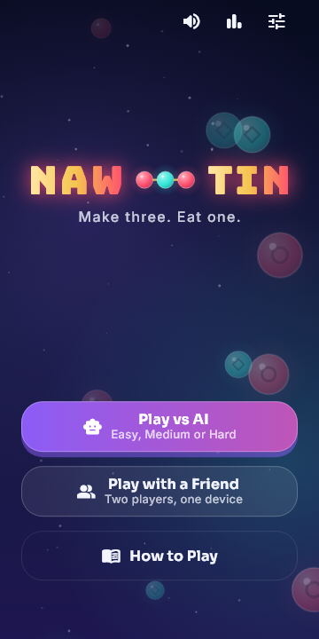
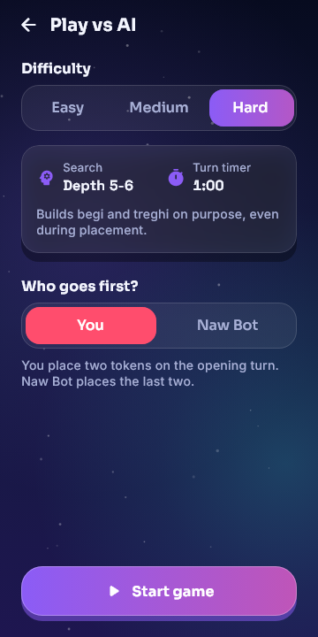
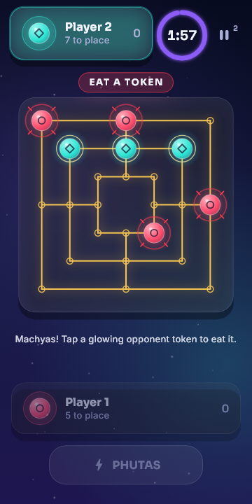
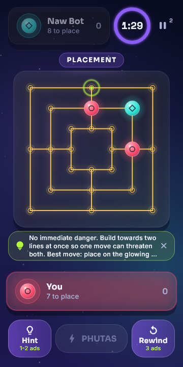

# Naw Tin

*Make three. Eat one.*

**Naw Tin** is a mill-style strategy board game for Android and iOS, built with
Flutter and Dart. Place your tokens on 24 points across three nested squares,
slide them along the lines, make three in a row and eat an opponent's token. It
is in the family of Nine Men's Morris, with its own twists: the **Begi** and
**Treghi** swinging-token moves and the **Phutas** warning call.

Play **against the computer** (three levels), **with a friend on one phone**, or
**online with a friend in a private room**: no account, no chat, just a six
character code.

<p align="center">
  
  
  
  
</p>

## Features

| | |
|---|---|
| **Three ways to play** | vs AI (Easy, Medium, Hard), two players on one device, or online with a remote friend |
| **Online private rooms** | create a room, share the code, play. Anonymous sign-in (Firebase), ready/start lobby, coin-flip first move, rematch with swapped seats, rejoin after a dropped connection or a killed app |
| **Fair and authoritative** | the server owns the game state and the turn clock and validates every move with the same engine as the app; phones only send intentions |
| **Real strategy AI** | iterative-deepening alpha-beta search with a transposition table, quiescence and killer/history move ordering, running on a background isolate. Hard looks up to 16 moves ahead |
| **Calm online etiquette** | six preset emotes (no free-text chat), "Hide emotes", report a player, instant forfeit only on the confirmed Leave button, a 45 s reconnect window for drops |
| **Polished feel** | "Midnight Neon Arcade" look, animated board and call banners, synthesized sound, haptics, Low-power and Reduce-motion modes |
| **Accessible** | every board point is a labelled screen-reader control, moves are announced, colour-blind-safe tokens, 48 dp touch targets |
| **Hints and rewind** | optional, paid with rewarded ads, vs-AI only. Never any ads during a live online game |

## Rules in one screen

- **Placement:** each player opens with two tokens, then turns alternate one
  token at a time. Lines made while placing count.
- **Movement:** slide a token one step along a line to an empty point.
- **PHUTAS** (button): "I am one move from a new line." Only a warning.
- **MACHYAS:** complete a line and eat one opponent token (not one in a finished
  line, unless every token is protected).
- **BEGI / TREGHI:** one token swinging between two / three points completes a
  line at every stop. 32 + 16 patterns, all generated from the board.
- **Win:** opponent down to 2 tokens or no legal move. Draw on 3-fold repetition.
- **Turn clock:** 2 minutes online and in two-player (against the AI: 2:00 Easy,
  1:30 Medium, 1:00 Hard). The first timeout plays a simple move for you; a
  second one **in a row** loses. Any move of your own clears the warning.

## Quick start

You need the Flutter SDK (developed on 3.47) and, for Android builds, the Android SDK.

```bash
flutter pub get
flutter run                          # any device; mock ads
flutter run --dart-define=ADS=admob  # Google AdMob *test* ads (phone only)
flutter test                         # app tests
```

### Try online play on your own machine

```powershell
# terminal 1: the server, with fake test tokens (LOCAL ONLY)
cd server; dart pub get
$env:NAWTIN_TEST_AUTH = "1"; dart run bin/server.dart      # listens on :8080

# terminal 2: two clients (two emulators, or an emulator and Chrome)
flutter run     # debug build: Settings > "Online test console (debug)"
```

Real Firebase sign-in, phones on Wi-Fi, and the two-phone checklist are in
[docs/online_dev.md](docs/online_dev.md) and
[docs/two_device_test_plan.md](docs/two_device_test_plan.md).

Firebase config is **not** in the repository: put your own
`android/app/google-services.json` in place (it is git-ignored).

## Architecture

```
packages/naw_tin_core/   pure Dart, no Flutter: engine, AI, shared online protocol
server/                  Dart WebSocket server (rooms, clock, auth, rate limits)
lib/                     the Flutter app
  core/          re-export shims for packages/naw_tin_core
  features/      splash, home, setup, game, how_to_play, online (menu, join, lobby, game)
  services/      clock, ads, sound, haptics, settings, stats, online connection layer
  theme/         design tokens (ThemeExtension), typography
  widgets/       board painter, cards, dock, banners, glass, buttons
test/            engine, AI, services, screens, accessibility, performance, online
scripts/         deploy_server.ps1 (Cloud Run)
docs/            protocol, deployment, test plan, store and privacy checklists
```

State management is **Riverpod**. The engine, AI, protocol and server import no
Flutter or Riverpod code, so they run in an isolate and in plain Dart, and the
app and the server share the exact same rules.

### Online design in short

- **WebSocket, JSON, versioned.** Protocol v1; an app that is too old gets a
  "Please update" screen instead of a broken game. Full spec:
  [docs/online_protocol.md](docs/online_protocol.md).
- **Server is the single source of truth.** Clients send moves and show what the
  server confirms. Move numbers make every message safe to repeat after a dropped
  connection; a full state resync follows every reconnect.
- **Clock agreement.** The phone measures its offset from the server's clock, so
  both players see the same countdown even if one phone's clock is wrong.
- **Sign-in:** Firebase anonymous auth, verified on the server with Google's
  public keys. A test-token mode exists for local development only and the server
  refuses to start with it on Cloud Run; release apps cannot use it.
- **Safety:** display-name filter, rate limits per user and per IP, a 4 KB frame
  cap, preset emotes only, reports with fixed reasons.
- **Hosting:** one Cloud Run instance (rooms live in memory):
  [docs/deploy_cloud_run.md](docs/deploy_cloud_run.md).

### AI

Difficulty is how far ahead the search may look and for how long. Depth is
counted in plies (one player's move): Easy up to 6 plies (3 turns each) in 0.4 s,
Medium up to 10 (5 turns each) in 1 s, Hard up to 16 (8 turns each) in 2 s. The
search deepens one ply at a time and stops at the ceiling or the time limit, so a
faster phone looks further than a slow one; each level has a guaranteed minimum
depth (3 / 5 / 7) it will overrun the clock a little to reach. It uses
principal-variation search, a transposition table, killer/history ordering, late
move reductions and quiescence, and is checked against plain minimax in the tests. Easy cannot see begi/treghi; Medium and Hard can.
Everything runs on a background isolate, so the screen never freezes.

Strength, measured in self-play at the real time limits (small samples): the new
Hard beat the previous Hard 7-1, the new Medium beat the new Easy 7-1, and the new
Hard beat the new Medium 5-1 with 2 draws.

**Timeouts** (the usual casual-game practice): the first timeout plays a simple
legal move for the player (the Easy-level search, never random and never the Hard
hint search, and it also picks which token to eat); a second one in a row
forfeits.

### Seat balance

Self-play (100+ independent Hard-vs-Hard games per rule) measured three
placement orders:

| Rule | seat 0 wins | seat 1 wins |
|---|---|---|
| Original: seat 0 opens with two, seat 1 places its last two in a row | 24 | 74 |
| Strict alternation, no doubles | 66 | 29 |
| **Both players open with two tokens (the default)** | 61-71% of decisive games | 29-39% |

The default is the third: nobody gets a closing double, and both players start
with two tokens. Being first to move still carries a modest edge, so a **rematch
swaps who starts**. Against the AI you choose who goes first. The original order
is available as `Rules.placementRule = PlacementRule.openingAndClosingDouble`.

### Sound and accessibility

- One distinct synthesized effect per call and event (`tool/make_sounds.py`);
  replace any `assets/audio/*.wav` with a recording. Local-language voice lines
  drop into `assets/audio/voice/<lang>/` (see the README there).
- Reduce-motion and low-power settings; screen-reader labels for every point and
  announcements for moves, banners and game over.

## Testing

| Package | Command | Tests |
|---|---|---|
| App | `flutter test` | 221 (4 skipped on purpose) |
| Core engine and AI | `cd packages/naw_tin_core && dart test` | 121 |
| Server | `cd server && dart test` | 92 |

The server tests include whole simulated games checked against a local replay of
the same moves, reconnect and forfeit rules, duplicate and out-of-order messages,
auth with real RS256 tokens, rate limits, and a real-socket smoke test. App
tests include 48 widget tests of every online screen and release-safety guards
(no debug console, no fake sign-in, no plain `ws://`, no ads in a live online
game). `dart run tool/check.dart <server url>` smoke-tests a running server.

## Documentation

| | |
|---|---|
| [docs/DEPLOYMENT.md](docs/DEPLOYMENT.md) | **start here to ship it:** accounts, Firebase, server, signed release, testing, Play Console, updates |
| [docs/online_protocol.md](docs/online_protocol.md) | the wire protocol |
| [docs/online_dev.md](docs/online_dev.md) | running online play locally, real sign-in |
| [docs/deploy_cloud_run.md](docs/deploy_cloud_run.md) | putting the server on Google Cloud Run |
| [docs/two_device_test_plan.md](docs/two_device_test_plan.md) | step-by-step test with two phones |
| [docs/store_checklist.md](docs/store_checklist.md) | Data safety, content rating, Firebase and release checklist |
| [docs/PLAY_STORE.md](docs/PLAY_STORE.md) | build, signing and store listing |
| [docs/PRIVACY_POLICY.md](docs/PRIVACY_POLICY.md) | privacy policy draft (fill the placeholders) |
| [docs/PLAYTEST.md](docs/PLAYTEST.md) | guide for human testers |
| [server/README.md](server/README.md) | the server |

## Status

- Offline game (engine, AI, UI, sound, hints and rewind, accessibility, store
  assets): complete.
- Online private-room play: complete in code and tests (client, server, UI,
  emotes, reports, deployment guide). **Still to do by hand:** try real Firebase
  sign-in on a phone, deploy to Cloud Run, run the two-phone plan, publish the
  privacy policy, and set up AdMob and the Play Console.
- Not built on purpose: free-text chat, accounts and passwords, matchmaking
  with strangers, ranked play.

## License

No license file has been added yet. Until one is, all rights are reserved by the
author; add a `LICENSE` file before sharing the code publicly.
